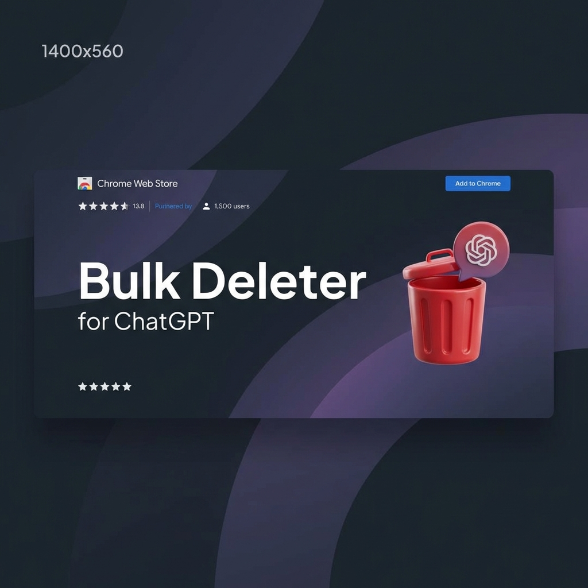

# Bulk Delete Chats for ChatGPT 🗑️



**The #1 Chrome Extension to bulk delete ChatGPT history.**  
Select multiple chats, wipe your entire history, and clean up your sidebar instantly.

## 🚀 Features
*   **Bulk Selection:** Checkboxes for every chat. Select one, select all.
*   **One-Click Delete:** Remove 100+ chats in seconds.
*   **Smart & Safe:** Simulates native user clicks. No API calls, no bans.
*   **Privacy First:** Runs locally. No data collection.
*   **Dark Mode:** Beautiful UI that matches ChatGPT's theme.

## 📥 Installation

### From Chrome Web Store
[Link Coming Soon]

### Manual Installation (Developer Mode)
1.  Clone this repository:
    ```bash
    git clone https://github.com/Anujch8889/ChatGptBulkChatDelets.git
    ```
2.  Open Chrome and navigate to `chrome://extensions/`
3.  Toggle **Developer Mode** (top right).
4.  Click **Load Unpacked**.
5.  Select the folder where you cloned this repo.

## 🛠️ How to Use
1.  Open the ChatGPT Sidebar.
2.  Click the **Trash Icon** in your Chrome Toolbar.
3.  Click **"Select All"** or manually check the chats you want to delete.
4.  Click **"Delete Selected"**.

## 🔒 Privacy Policy
We do not collect any user data. All operations are performed locally on your machine using `activeTab` and `scripting` permissions to interact with the DOM.

## 🤝 Contributing
Pull requests are welcome! For major changes, please open an issue first to discuss what you would like to change.

## 📄 License
[MIT](https://choosealicense.com/licenses/mit/)
